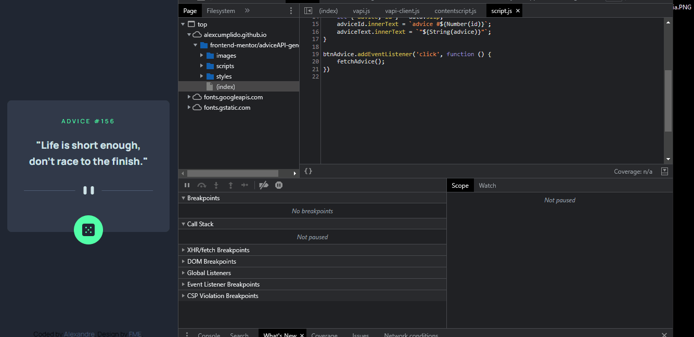

## Advice generator app
- [Github Pages live](https://alexcumplido.github.io/frontend-mentor/adviceAPI-generator) | [Frontend Mentor solution](https://www.frontendmentor.io/solutions/vanilla-js-and-css-advice-generator-dMaq1tvQ07)

### Table of contents
- [User flow](#user-flow)
- [Demo](#demo)
- [Run project](#run-project)
- [Built with](#built-with)

#### User flow
- Generate a new piece of advice by clicking the dice icon
- See hover states for all interactive elements on the page
- View the optimal layout for the app depending on their device's screen size

#### Demo


#### Run project
```
# Just a local development server
```

#### Built with
- Semantic HTML5 markup
- CSS custom properties
- JavaScript
- Mobile-first workflow
