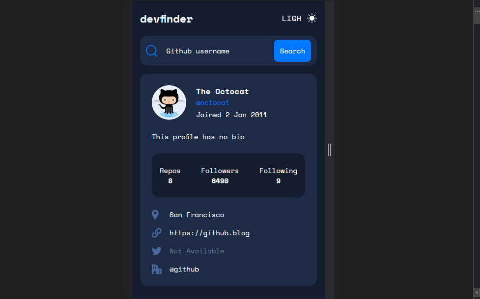

## GitHub user search app
[Github Pages live](https://alexcumplido.github.io/frontend-mentor/github-user-api/) | [Frontend Mentor solution](https://www.frontendmentor.io/challenges/github-user-search-app-Q09YOgaH6)

### Table of contents
- [User flow](#user-flow)
- [Screenshot](#screenshot)
- [Run project](#run-project)
- [Built with](#built-with)
- [Thoughts](#thoughts)

#### User flow
- Search for GitHub users by their username
- See relevant user information based on their search
- Switch between light and dark themes
- View the optimal layout for the app depending on their device's screen size
- See hover states for all interactive elements on the page

#### Screenshot


#### Run project
```
# Just a local development server
```

#### Built with
- Semantic HTML5 markup
- CSS custom properties
- JavaScript
- 3rd-party API
- Mobile-first workflow
- Design System
