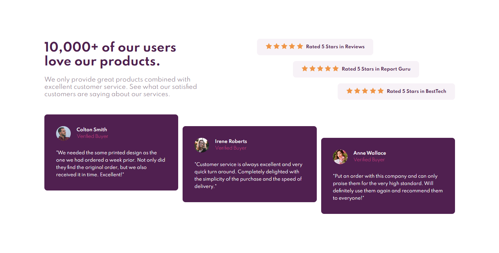

## Responsive Grid Section

### Table of contents
- [Overview](#overview)
    - [User flow](#user-flow)
    - [Screenshot](#screenshot)
    - [Links](#links)
- [Development process](#development-process)
    - [Run project](#run-project)
    - [Built with](#built-with)
    - [What I learned](#what-i-learned)
    - [Continued development](#continued-development)
    - [Useful resources](#useful-resources)

### Overview

#### User flow
- View the optimal layout for the component depending on their device's screen size

#### Screenshot


#### Links
- Live Site: [Github Pages](https://alexcumplido.github.io/frontend-mentor/grid-section/)
- Solution: [Frontend Mentor solution](https://www.frontendmentor.io/solutions/flexboxgrid-with-minimal-media-query-HyEJqhZmc)

### Development process

#### Run project
```
# Just a local development server
```

#### Built with
- Semantic HTML5 markup
- CSS custom properties
- Flexbox
- Grid Layout
- Media Queries
- Mobile-first workflow

#### What I learned
I used a mix approach during the CSS coding. I started with a mobile first technique taking advantage of the normal flow of the page, but for the desktop view I employed grid for the outer layout and flexbox for inner one. I think both techniques combine pretty well in this case, Grid is very powerfull when it comes to place elements in the overall layout, flexbox gives you less control in that sense but for small components like the rating or comments containers let you control the items as a group.

#### Continued development
I am looking forward to reduce the code in the Media Query, I think there to much code relying on the Media Query.

#### Useful resources
- [CSS tricks Grid Layou guide](https://css-tricks.com/snippets/css/complete-guide-grid/). Again CSS tricks allways is an incredible resource for Flexbox as well for Grid. You can understand in deep parents and children behaviour.