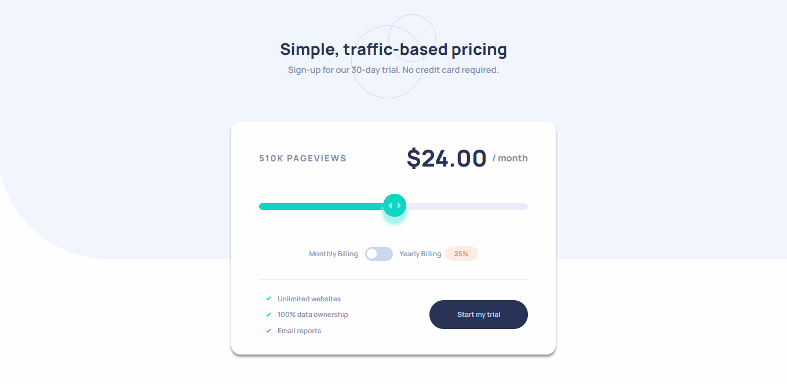

## Interactive Price Component
[Github Pages live](https://alexcumplido.github.io/frontend-mentor/interactive-pricing/) | [Frontend Mentor solution](https://www.frontendmentor.io/solutions/custom-input-range-with-plain-javascript-cIV6GtJfXw)

This project is an interactive pricing component with a custom range input slider and a pricing toggle.

### Table of contents
- [User flow](#user-flow)
- [Demo](#demo)
- [Run project](#run-project)
- [Built with](#built-with)
- [Thoughts](#thoughts)
- [Continued development](#continued-development)

#### User flow
- Use the slider and toggle to see prices for different page view numbers.
- If the user switches the toggle to yearly billing apply a 25% discount to all prices.
- See hover states for all interactive elements.
- View the optimal layout depending on device's screen size.

#### Demo


#### Run project
```
git clone https://github.com/alexcumplido/frontend-mentor.git
# Then a local development server like Live Server.
```

#### Built with
- Semantic HTML5 markup
- CSS custom properties
- JavaScript
- Mobile-first workflow

#### Thoughts
In this project I had to balance between focusing on UI or UX. At first I considered using the input attribute `max`,`min` and `steps` to create a better UX helping the user the visualize each step of their range, but then I realize that I was not able to style the progression of the slider `::-webkit-slider-runnable-track`, since it just jumped from one range to another without the movement effect. Also this task is a little bit tricky because cross-browsing compatibility, Safari and Firefox browser offer native css selectors to acess all the elements of an `input[type=range]` but Chrome does not offer the the possibility to style directly the progression of the slider. So reasearching I found [BrennaObrien](https://brennaobrien.com/blog/2014/05/style-input-type-range-in-every-browser.html) and [Nikita Hlopov](https://nikitahl.com/style-range-input-css) used interesting techniques to style the progression of the slider and applied to my code.

```js
const inputRange = document.querySelector('.card__input');
function handleUpdateSlider() {
    inputRange.style.backgroundSize =
        `${(inputRange.value - inputRange.min) * 100 / (inputRange.max - inputRange.min)}% 100%`
}
```
The function calculates a dynamic background based on a percentage of what value is deciding the user to select from the input. In this case `inputRange` targets the input accessing its current `value` and `max` and `min` atttributes.

A list of things learned doing this project:
- Applied [Josh Comeau](https://www.joshwcomeau.com/css/custom-css-reset/) reset stylesheet
- Add [`aria-pressed`](https://developer.mozilla.org/en-US/docs/Web/Accessibility/ARIA/Attributes/aria-pressed) and improve accessibility for toggle buttons.
- Using [`cursor:grab`](https://developer.mozilla.org/en-US/docs/Web/CSS/cursor) and [`cursor:grabbing`](https://developer.mozilla.org/en-US/docs/Web/CSS/cursor) to increase UX.
- Overriding User Agent Stylesheets.

#### Continued development
I am looking to refactor some of the JS logic, especially the `handleUpdatePlan(event)` function which I consider holding too much functionality.