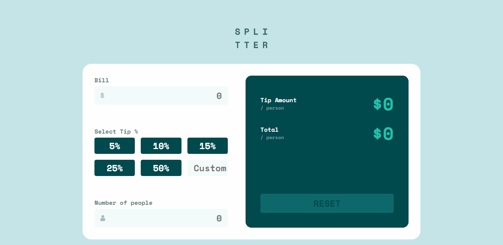

## Tip Calculator App
[Live Tip calculator](https://alexcumplido.github.io/frontend-mentor/tip-calculator/)

### Table of contents
- [User flow](#user-flow)
- [Screenshot](#screenshot)
- [Run project](#run-project)
- [Built with](#built-with)
- [Thoughts](#thoughts)
- [Continued development](#continued-development)

#### User flow
- Calculate correct tip and total cost of the bill per person
- View  optimal layout for the app depending on their device's
- See hover states for all interactive elements

#### Screenshot


#### Run project
```
# Clone the repository
# Open via a local development server
```

#### Built with
- Semantic HTML5 markup
- CSS custom properties
- JavaScript
- Document Object Model manipulation
- Mobile-first workflow

#### Thoughts
Styled the radio inputs following the same technique applied to the [Interactive Rating Component](https://github.com/alexcumplido/frontend-mentor/tree/main/rating-modal#thoughts). Working around styling the label of the input instead of the input itself, explained in this [blog-post](https://markheath.net/post/customize-radio-button-css) based on this [question](https://stackoverflow.com/questions/4641752/css-how-to-style-a-selected-radio-buttons-label) from StackOverflow.

I found really useful when planning the project apply an Agile method known as [User Stories](https://www.mountaingoatsoftware.com/agile/user-stories). The method itself focuses elaborating the requirements as a user and not as a developer, so you can emulate the user needs as best as possible. Some examples are:

As a `type of user`, I want `some goal` so that `some reason`;

    As a User I want to split the bill and tip so I know how much each must pay.
    As a User I want to input a customized Tip so I do not rely only on the app default percentages.
    As a User I want to reset the whole calculator so I can perform new calculations.

 When handling the DOM traversing showing and hidding error messages I was generating code duplication so I took a functional approach abstracting that code into one unique function. `handleError` is called receiving as arguments the input and error that we pretend to change via DOM, plus a callback that when runned inside the function body will serve as a conditional test. 

```js
const testBill = () => Number(inputBill.value >= 100000);
const testPeople = () => Number(inputNumPeople.value == false);

function handleError(inputEl, errorEl, callback) {
    if (callback()) {
        inputEl.classList.add('input-error');
        errorEl.classList.replace('visually-hidden', 'error');
    } else {
        inputEl.classList.remove('input-error');
        errorEl.classList.replace('error', 'visually-hidden');
    }
}

inputBill.addEventListener('input', function () {
    updatePrice();
    handleError(inputBill, errorBill, testBill);
});
```

#### Continued development
I would like to review the whole project looking for increase Accessibility compliance.
 